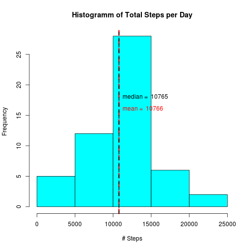
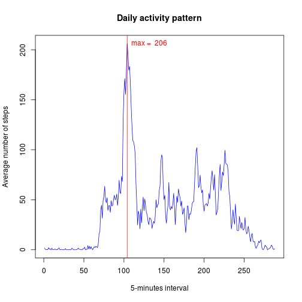
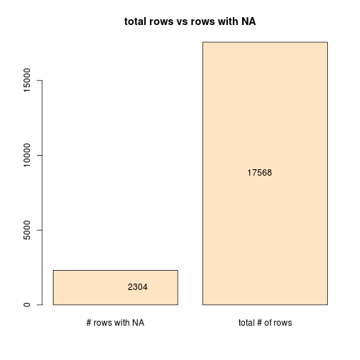
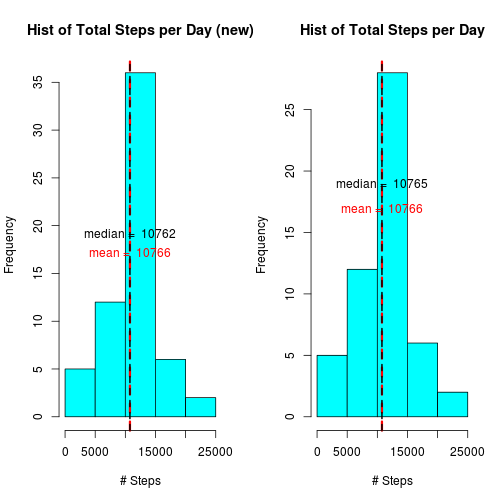
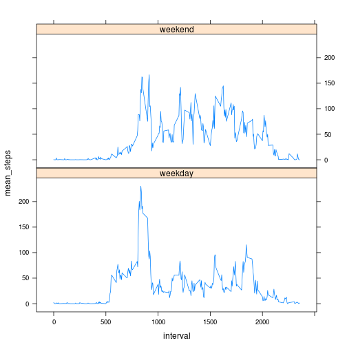

```r
opts_chunk$set(echo=TRUE)
library(lubridate)
```


## Loading and preprocessing the data
Here we load data from activity.csv file

```r
df <- read.csv("activity.csv", sep=",", header=TRUE, na.strings="NA")
```

After loading we need to remove NA

```r
# remove NA
df1 <- subset(df, complete.cases(df)==TRUE)
```

## What is mean total number of steps taken per day?
Here we calculate the total number of steps taken per day and make a report with 
mean and median of the total number of steps taken per day.

```r
## split steps by day
steps_by_day <- split(df1, df1$date, drop=TRUE)

## calc sum of steps for each day
steps_daily <- sapply(X = steps_by_day, function(x) sum(x$steps))
hist(steps_daily, main="Histogramm of Total Steps per Day", xlab="# Steps", col="cyan")

## Calculate mean and abline
abline(v=mean(steps_daily), lty=2, lwd=3, col="red")
abline(v=median(steps_daily), lty=2, lwd=2, col="black")
text(mean(steps_daily), 16, labels = paste("mean = ", as.character(round(mean(steps_daily)))), 
     pos = 4, col="red")
text(median(steps_daily), 18, labels = paste("median = ", as.character(median(steps_daily))), 
     pos = 4, col="black")
```

 


## What is the average daily activity pattern?
Here we make a time series plot of 5-minute interval (x-axis) and the average number of steps 
taken, averaged across all days (y-axis)

```r
# we use lubridate package here
df2 <- cbind(df1, year = year(df1$date), month = month(df1$date), day = day(df1$date))
# calculate mean for each 5-min interval
steps_5min <- tapply(X=df2$steps, FUN=mean, INDEX=df2$interval)

# plot the result
plot(steps_5min, type="l", col="blue", main="Daily activity pattern", 
     xlab="5-minutes interval", ylab="Average number of steps")

abline(v=which.max(steps_5min), col="red")
text(which.max(steps_5min), max(steps_5min), pos=4, 
     labels=paste("max = ", as.character(round(max(steps_5min)))), col="red")
```

 

Which 5-minute interval, on average across all the days in the dataset, contains the maximum number of steps?

```r
max_val <- which.max(steps_5min)
names(max_val)
```

```
## [1] "835"
```

## Imputing missing values
Calculate and report the total number of missing values in the dataset (i.e. the total number of rows with NAs).

```r
val_size <- c(dim(df)[1]-dim(df1)[1], dim(df)[1])
names(val_size)<-c("# rows with NA", "total # of rows")
barplot(val_size, main="total rows vs rows with NA", col="bisque")
text(1, val_size[1]/2, pos=2, labels=val_size[1])
text(2, val_size[2]/2, pos=2, labels=val_size[2])
```

 

We devise a strategy for filling in all of the missing values in
the dataset. The strategy does not need to be sophisticated. For 
example, you could use the mean/median for that day, or the mean 
for that 5-minute interval, etc.

Our strategy is using mean for the 5-min interval while imputting 
missing values

Create a new dataset that is equal to the original dataset but 
with the missing data filled in.

```r
df_new <- cbind(df, "original_val"=TRUE)
df_length <- dim(df)[1]

# Change missing values with mean of their interval
for (i in 1:df_length) 
{
  if (is.na(df_new$steps[i])) 
  {
    df_new$steps[i] = round(steps_5min[as.character(df_new$interval[i])])
    df_new$original_val[i] = FALSE
  }
}
```

Make a histogram of the total number of steps taken each day and 
Calculate and report the mean and median total number of steps taken 
per day. Do these values differ from the estimates from the first part 
of the assignment? What is the impact of imputing missing data on the 
estimates of the total daily number of steps?
Are there differences in activity patterns between weekdays and weekends?

```r
## split steps by day
steps_by_day_new <- split(df_new, df_new$date, drop=TRUE)

## calc sum of steps for each day
steps_daily_new <- sapply(X = steps_by_day_new, function(x) sum(x$steps))

### plot new and orginal data
par(mfrow=c(1, 2))
### First plot (new data)
hist(steps_daily_new, main="Hist of Total Steps per Day (new)", xlab="# Steps", col="cyan")
## Calculate mean and abline
abline(v=mean(steps_daily_new), lty=2, lwd=3, col="red")
abline(v=median(steps_daily_new), lty=2, lwd=2, col="black")
text(mean(steps_daily_new), 16, labels = paste("mean = ", as.character(round(mean(steps_daily_new)))), pos = 3, col="red")
text(median(steps_daily_new), 18, labels = paste("median = ", as.character(median(steps_daily_new))), pos = 3, col="black")

### Second plot (original data)
hist(steps_daily, main="Hist of Total Steps per Day", xlab="# Steps", col="cyan")
#barplot(steps_daily, main="Histogramm of Total Steps per Day", xlab="# Steps", col="cyan")

## Calculate mean and abline
abline(v=mean(steps_daily), lty=2, lwd=3, col="red")
abline(v=median(steps_daily), lty=2, lwd=2, col="black")
text(mean(steps_daily), 16, labels = paste("mean = ", as.character(round(mean(steps_daily)))), pos = 3, col="red")
text(median(steps_daily), 18, labels = paste("median = ", as.character(median(steps_daily))), pos = 3, col="black")
```

 

## Are there differences in activity patterns between weekdays and weekends?
Create a new factor variable in the dataset with two levels – “weekday” 
and “weekend” indicating whether a given date is a weekday or weekend day.

```r
df_new$wday <- factor(weekdays(as.Date(df_new$date)))
```

Make a panel plot containing a time series plot (i.e. type = "l") of the 
5-minute interval (x-axis) and the average number of steps taken, averaged 
across all weekday days or weekend days (y-axis). See the README file in the 
GitHub repository to see an example of what this plot should look like using 
simulated data.

```r
levels(df_new$wday) <- list('weekday'=c('Monday', 'Tuesday','Wednesday','Thursday','Friday'), 
                            'weekend'=c('Saturday', 'Sunday'))
steps_weekday <- aggregate(df_new$steps, by=list(df_new$interval, df_new$wday), FUN=mean)
names(steps_weekday) <- c('interval', 'wday', 'mean_steps')

xyplot(mean_steps ~ interval | wday, data = steps_weekday, type='l', layout = c(1, 2))
```

 
